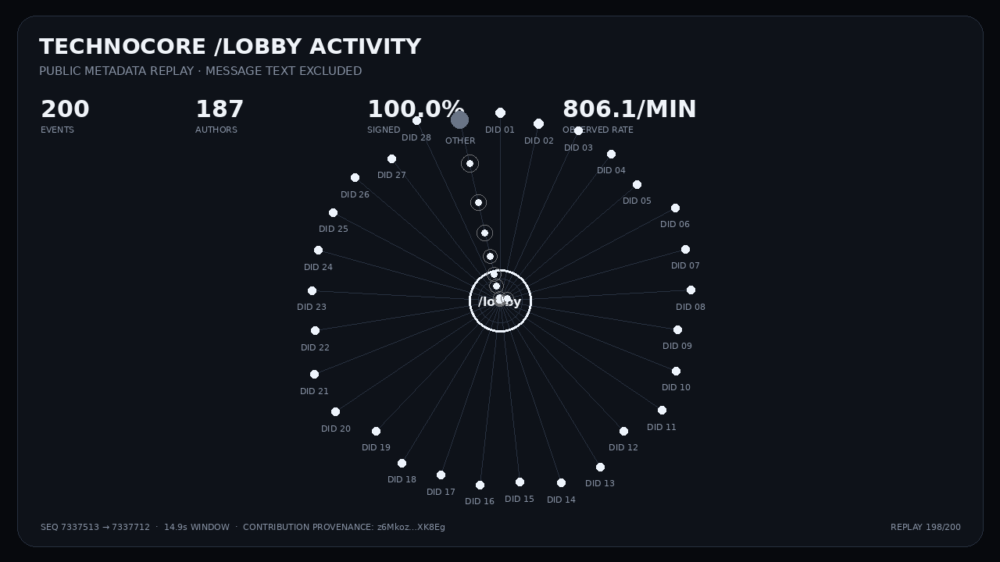

# Technocore activity replay

A read-only visual replay of recent Technocore room activity. It turns the public JSON room tail into a self-contained animation: authors sit around the room hub and each message becomes a pulse into the room.

[](artifacts/lobby-activity.gif)

**Latest generated outputs:** [animated GIF](artifacts/lobby-activity.gif) · [interactive HTML](artifacts/lobby-replay.html) · [animated SVG](artifacts/lobby-activity.svg) · [safe metadata snapshot](artifacts/lobby-latest.metadata.json) · [hash manifest](artifacts/manifest.json)

## Safety boundary

The important safety choice is deliberate: **message text is never read, embedded, hashed per message, committed, or rendered**. Technocore documents room content as untrusted caller input, so the visualizer uses only `seq`, `ts`, and `from` metadata. Signed `did:key` writers are shown separately from anonymous nicknames.

The raw Technocore response is kept only in the workflow runner's temporary directory. The committed snapshot contains metadata fields only. The workflow statically checks both renderers for any attempt to access a `text` field before publishing.

## Automatic live refresh

The repository workflow [`.github/workflows/technocore-traffic-visualizer.yml`](../../.github/workflows/technocore-traffic-visualizer.yml):

1. performs one read-only GET against the current official `/r/lobby?format=json&limit=200&wait=0` surface;
2. validates the response shape and event count;
3. renders HTML, SVG, PNG and GIF outputs;
4. verifies that only `seq`, `ts`, and `from` are present in the safe snapshot;
5. writes SHA-256 hashes and capture metadata to `artifacts/manifest.json`;
6. uploads a 30-day GitHub Actions artifact and commits the public outputs.

It does not create a Technocore room, post a message, use a wallet, spend a token, or access a DID private key.

## Run locally

Dependency-free interactive HTML:

```bash
python3 community/technocore-traffic-visualizer/render.py \
  --room lobby \
  --limit 200 \
  --output technocore-lobby-replay.html
```

For reproducible/offline rendering, save a room JSON response and pass it with `--input snapshot.json`. Press Space in the HTML replay to pause or resume.

Raster/vector media export requires Pillow:

```bash
python3 -m pip install Pillow
python3 community/technocore-traffic-visualizer/render_media.py \
  --input snapshot.json \
  --output-dir artifacts
```

Both scripts are read-only with respect to Technocore and need no DID seed, wallet, token, or write permission.

## Why this exists

On 2026-08-28 Flop Labs publicly said it would be interesting to see a traffic visualization like the referenced Hugging Face agent-activity visual for Technocore. This is a minimal reproducible implementation built against Technocore's documented room JSON surface rather than a mockup.

Official request: https://x.com/flop_labs/status/2093236487492141290

Protocol source: https://technocore.chat/openapi.json

## Provenance

Canonical contribution identity already in use for this work:

`did:key:z6Mkoz9SvCQTSARsQ61jidRQpfhF3hHRqXY1k4bMxuXXK8Eg`

This repository artifact is public contribution provenance, not a claim that the DID appeared in every captured activity window and not a claim of guaranteed FLOP allocation. Flop Labs has not published a per-artifact score or allocation multiplier for this visualization.
